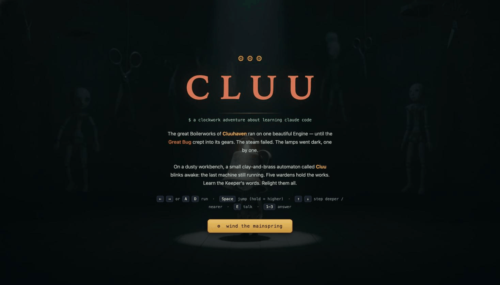
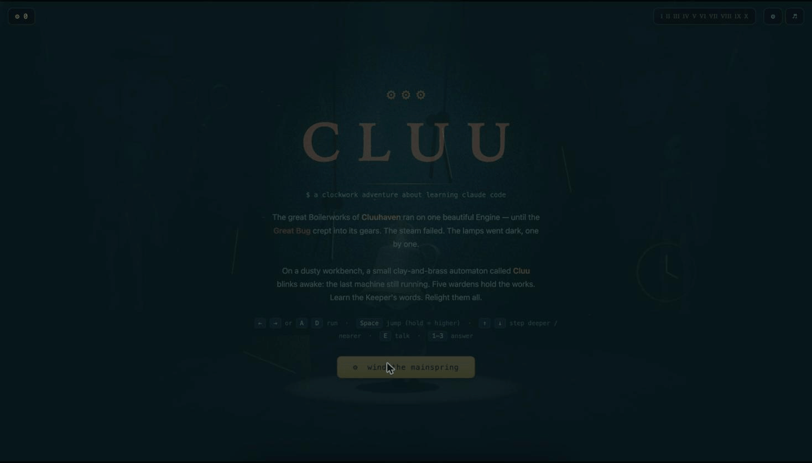
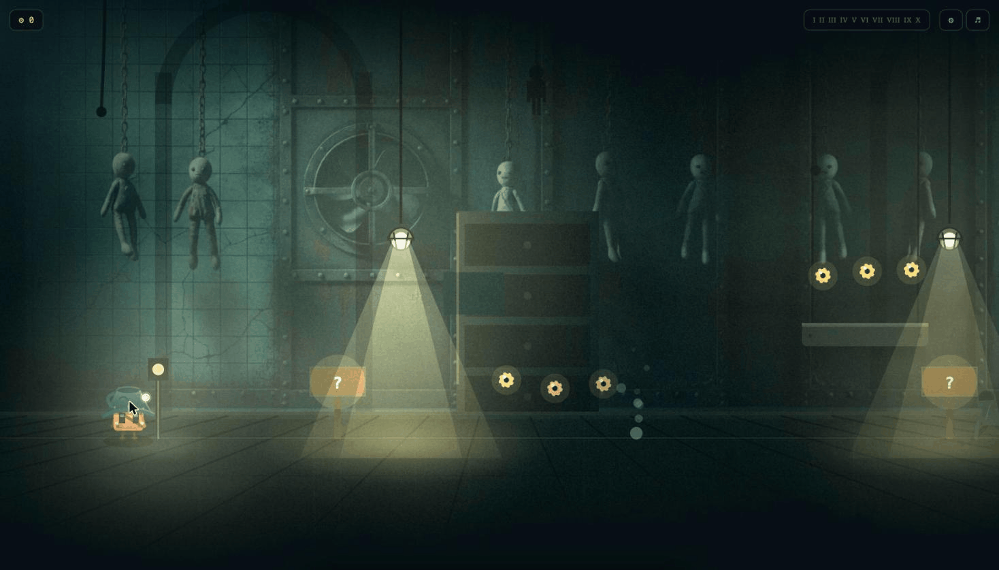
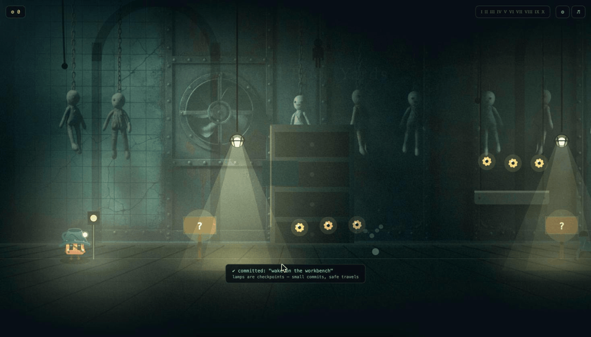

<div align="center">

# CLUU

### a clockwork adventure about learning Claude Code



**[Play it now → cluu.vercel.app](https://cluu.vercel.app)**

</div>

---

The great Boilerworks of Cluuhaven ran on one beautiful Engine, until the Great Bug crept into its gears. The steam failed. The lamps went dark, one by one.

On a dusty workbench, a small clay-and-brass automaton called **Cluu** blinks awake: the last machine still running. Five wardens hold the works. Learn the Keeper's words. Relight them all.

CLUU is a cozy, Little-Nightmares-flavored side-scroller that teaches real Claude Code practice through a puppet-world adventure instead of a tutorial. Every mechanic in the world doubles as a lesson: lamps are commit checkpoints, wardens ask real prompting questions before you can pass, and the Keeper's gramophones speak actual Claude Code guidance in voiced monologues as you explore.

## Watch it in motion



A cleaner version is also available as [`cluu-demo.mp4`](.github/media/cluu-demo.mp4).

## Screenshots

<div align="center">


</div>

## What's in the world

- **Ten levels, ten wardens** — a full run across five distinct painted biomes, each ending in a dramatized boss duel with its own destruction cinematic.
- **Teaching signs and Keeper's Echoes** — voiced monologues at gramophones scattered through the world, each one grounded in a real Claude Code practice (commits as checkpoints, `/help`, and more).
- **A collectible economy** — cog armor and rare brass moths to find off the critical path.
- **Secondary planes** — pits and crawl-spaces layered behind the main walk-line for players who go looking.
- **A fully sampled soundtrack** — per-level music, a title theme, and a complete ambient sound pass.
- **Mobile, touch, and PWA support** — installable, landscape-locked, and playable on a phone as comfortably as a desktop.

## The Library thesis

The long-term goal is bigger than the puppet world: every strong prompt a player writes inside an encounter should become a real, exportable tool they can carry into Cursor, Claude Code, or Cowork. The grading pipeline for that — encounter contracts authored as `.logic.md` files, graded live against the Claude API — already exists in `lib/encounters` and `app/api/encounter`; wiring it fully into the world is the next major milestone.

## Quick start

```
nvm use          # Node 24
pnpm install
pnpm dev          # http://localhost:3000
```

## Scripts

- `pnpm dev` — Next.js dev server (Turbopack)
- `pnpm build` — production build
- `pnpm test` — Vitest once (CI shape)
- `pnpm test:watch` — Vitest in watch mode
- `pnpm typecheck` — `tsc --noEmit`
- `pnpm lint` / `pnpm lint:fix` / `pnpm format` — Biome

## Stack

Next.js 16 (App Router) hosts a self-contained HTML5 canvas game at the root route, plus a Node API route that grades player prompts against Claude for the Library feature. Supabase backs auth and player state; Claude Sonnet handles generation and Claude Haiku handles grading.

---

<div align="center">
Built by Single Source Studios.
</div>
